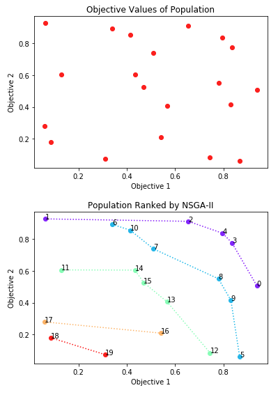

# nsga_sort
Ranks a set of objective values based Pareto dominance and crowding distance

The interesting part about NSGA-II is the non-dominated sorting with crowding distance, which boils down to a ranking of the population. This function returns only this ranking, to be used in NSGA-II or any other multiobjective algorithm.

All it does is this:

nothing more nothing less
